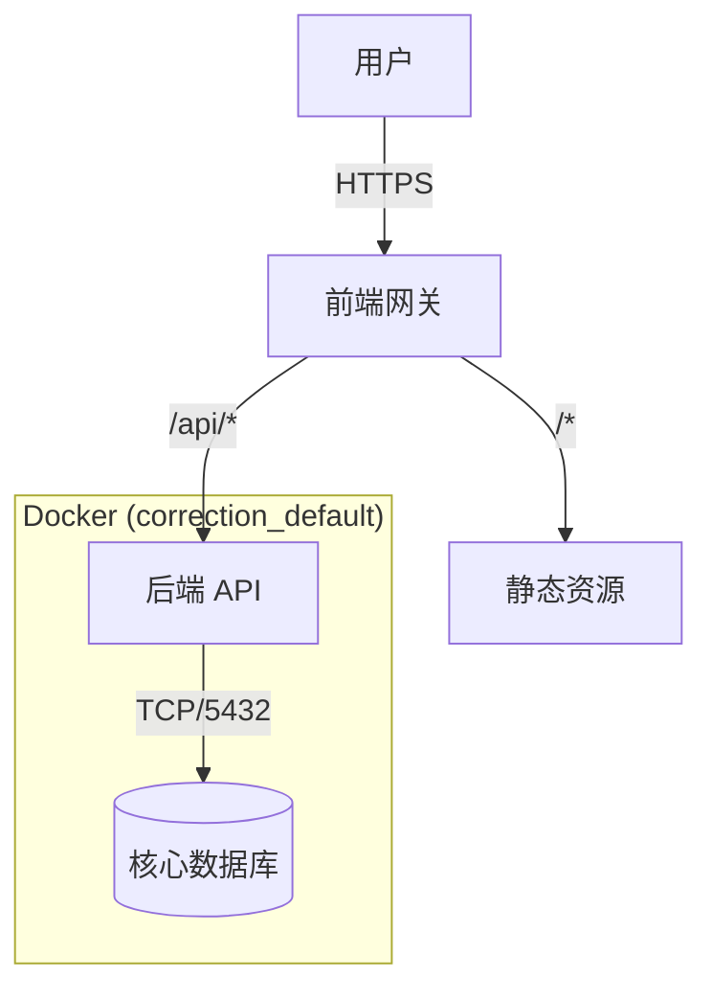

# Account System V1.6 (Frozen) - Part 1: Architecture

> **状态**: 🔒 **已封板 (Sealed)**
> **更新**: 2026-02-22
> **环境**: 腾讯云 (119.91.71.30)

## 1. 核心架构 (The Quadrangle Matrix)

本系统是产品矩阵的 **数字基座** (SSO/RBAC/Data)。

### 1.1 拓扑结构 (Topology)

回归稳健的单体分层架构：

