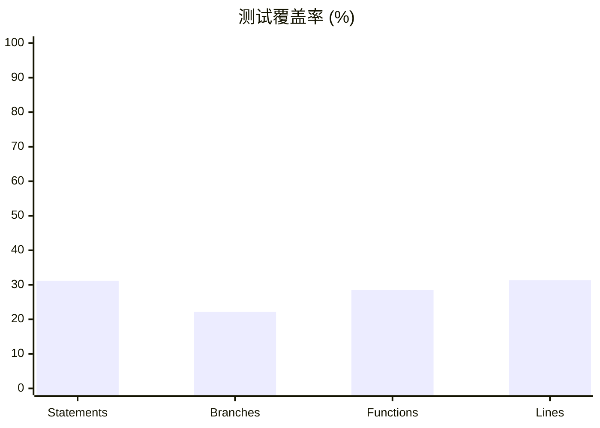
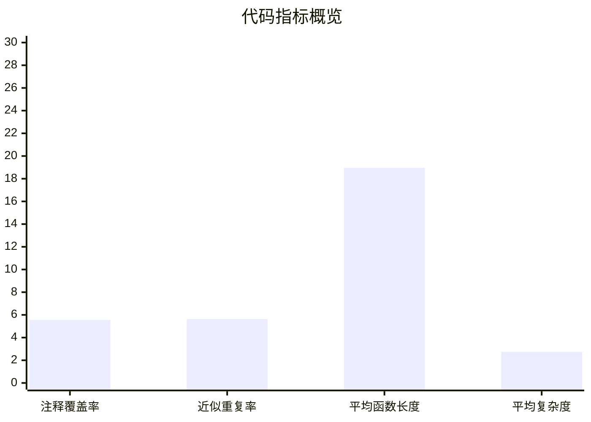

# 代码体检报告 (Codebase Health Report)

> **归档状态**: 已停用（仅供历史追溯，禁止作为当前开发依据）  
> **归档日期**: 2026-03-07  
> **停用原因**: 报告基于 V1.8.6 基线，结论与 V2.1 当前实现存在多处偏差。  

> **版本**: V1.8.6  
> **日期**: 2026-02-26  
> **范围**: 后端 (Node.js/Express)、前端 (React/Vite)、CLI 工具与配置  

---

## 1. 执行摘要

本次体检覆盖代码结构、逻辑缺陷、安全漏洞、性能瓶颈、可维护性、测试覆盖率、依赖风险、编码规范、文档一致性与可扩展性。整体风险等级为 **中等**。主要风险集中在 **邮件服务凭据存储、JWT 校验约束不足、依赖库高危漏洞、测试覆盖率偏低**。  

**结论要点**:
1. **高风险**: 邮件服务商密码以明文/未加密形式入库并使用 (需加密或密钥托管)。  
2. **高风险**: JWT 验证未强制算法/签发者/受众校验，存在 Token 误用风险。  
3. **中风险**: SSO 允许应用 Secret 回退到全局 Secret，扩散风险面。  
4. **中风险**: Rollup 存在高危漏洞 (CWE-22)，需升级到安全版本。  
5. **中风险**: 覆盖率不足，关键控制器与中间件覆盖率 < 15%。  

---

## 2. 扫描范围与方法

**自动化工具**
- ESLint：代码风格与常规缺陷检测 (通过)  
- TypeScript (tsc -b)：类型一致性检查 (通过)  
- Vitest 覆盖率：单元测试覆盖率分析  
- npm audit：依赖漏洞扫描  
- 自定义脚本：代码重复率、复杂度、函数长度与注释覆盖统计  

**工具缺口说明**
- SonarQube / PMD / FindBugs 当前未在项目中集成或不适用 JS/TS 技术栈，因此未执行。  

---

## 3. 结构与质量指标

| 指标 | 当前值 |
| :--- | :--- |
| 文件数 (JS/TS/TSX/JSX) | 106 |
| 总行数 | 8,989 |
| 注释覆盖率 | 5.55% |
| 函数数量 | 474 |
| 类数量 | 2 |
| 平均函数长度 | 18.96 行 |
| 近似平均圈复杂度 | 2.74 |
| 近似重复率 (5 行分片) | 5.63% |
| 单文件最大行数 | 371 (`src/components/admin/email/EmailConfig.tsx`) |

---

## 4. 可视化图表

### 4.1 覆盖率 (整体)

### 4.2 代码质量指标 (关键指标)

---

## 5. 高严重度问题清单 (已人工复核)

### 5.1 邮件服务商密码未加密存储 (高)
- **位置**: `controllers/emailConfigController.js:31-38, 66-69, 238-247`  
- **风险**: 若数据库泄露，邮件服务凭据将被直接获取。  
- **建议**:
  1. 使用 KMS 或 AES-256-GCM 加密后写入 `auth_pass_encrypted`。  
  2. 解密仅在内存中进行，不落盘、不回传。  
  3. 以环境变量注入加密密钥，禁止硬编码。  

### 5.2 JWT 验证缺少算法/签发者/受众限制 (高)
- **位置**: `utils/token.js:14-18`  
- **风险**: 非预期签发者或算法可绕过验证，尤其在多应用 SSO 场景中存在 Token 混用风险。  
- **建议**:
  1. `jwt.verify` 显式指定 `algorithms`, `issuer`, `audience`。  
  2. 统一在 `signToken` 中加上 `iss` 与 `aud`，并在验证时强制校验。  

### 5.3 SSO Secret 回退到全局 Secret (中)
- **位置**: `controllers/ssoController.js:50-51`  
- **风险**: 单点 Secret 泄露可能影响所有应用。  
- **建议**: 强制每个 App 独立 Secret，不允许回退到全局。  

---

## 6. 中/低严重度问题 (含上下文说明)

### 6.1 控制台日志未使用统一日志中间件 (中)
**规范**要求使用 `middlewares/logger.js`，但控制器内大量使用 `console.error`：  
- `controllers/authController.js:15,44,61,78,100,112,140`  
- `controllers/adminController.js:37,85,113,143,175,209`  
- `controllers/appController.js:38,49,64,91,115,130`  
- `controllers/emailConfigController.js:14,43,83,121,155,210`  
**建议**: 统一封装 logger（如 `req.logger` 或 `logger.error`）并替换。  

### 6.2 注释语言未统一为中文 (低)
示例：
- `controllers/emailConfigController.js:3-6`  
- `controllers/appController.js:5-8, 43-55`  
- `server.js:5`  

### 6.3 已确认的误报/低风险项
- `src/components/admin/email/EmailTemplates.tsx:271-273` 使用 `dangerouslySetInnerHTML`，但已通过 `DOMPurify.sanitize` 进行清洗，风险可控。  
- `packages/cli/src/index.js:133-136` 存在 `execSync`，但命令参数经过格式校验 (行 28-29, 110-113)，且调用的是内部 `validate` 子命令，风险可接受。  

---

## 7. 依赖风险与升级路径

### 7.1 npm audit 结果
- **高危漏洞**: `rollup`  
- **范围**: `>=4.0.0 <4.59.0`  
- **风险**: Path Traversal 导致任意文件写入 (CWE-22)  
- **建议**: 升级到 `4.59.0` 或更高版本 (建议执行 `npm audit fix` 或升级 Vite 依赖链)。  

---

## 8. 测试覆盖率与未覆盖模块

**总体覆盖率**
| Statements | Branches | Functions | Lines |
| :---: | :---: | :---: | :---: |
| 31.19% | 22.15% | 28.57% | 31.31% |

**覆盖率最低的关键模块 (Top 8)**
1. `controllers/ssoController.js`：2.78%  
2. `controllers/emailConfigController.js`：6.35%  
3. `src/core/AppLoader.js`：8.33%  
4. `controllers/adminController.js`：8.57%  
5. `controllers/appController.js`：11.29%  
6. `controllers/emailTemplateController.js`：11.76%  
7. `controllers/dashboardController.js`：12.50%  
8. `middlewares/auth.js`：18.18%  

**文档一致性检查**
- `docs/04_部署运维/02_测试策略.md` 当前标记覆盖率 <1%，与本次覆盖率统计不一致，应更新至真实数据并同步目标与现状。  

---

## 9. 编码规范符合性 (节选)

### 9.1 已发现的违规项
1. **日志规范**: 业务控制器应统一使用 `middlewares/logger.js`，但当前直接 `console.error`。  
2. **注释语言**: 多处英文注释，违反“文档/注释中文化”规则。  

### 9.2 修正示例 (示意)
- 日志替换示例：统一引入 logger 并输出结构化日志。  
- 注释替换示例：将英文注释翻译为中文说明。  

---

## 10. 文档完整性与一致性

1. **JWT 规范不一致**: `docs/02_开发指南/02_JWT认证指南.md` 要求强制校验 `issuer`/`algorithms`，但实现未体现。  
2. **测试策略过期**: `docs/04_部署运维/02_测试策略.md` 现状指标与实测覆盖率不符。  

---

## 11. 可维护性、性能与可扩展性

1. **动态加载风险**: `src/core/AppLoader.js` 使用 YAML 配置驱动动态导入，若配置被篡改可导致执行非预期代码。  
2. **运行时迁移**: AppLoader 在运行期执行 `ALTER TABLE`，可能在生产环境带来锁表风险，应迁移至独立脚本。  
3. **模块耦合**: Email 与 Auth 逻辑存在跨模块依赖，建议进一步拆分服务边界。  

---

## 12. 风险矩阵与修复优先级

| 风险项 | 影响 | 发生概率 | 综合等级 |
| :--- | :--- | :--- | :--- |
| 邮件凭据明文存储 | 高 | 中 | 高 |
| JWT 校验弱约束 | 高 | 中 | 高 |
| Rollup 高危漏洞 | 中 | 中 | 中 |
| SSO Secret 回退 | 中 | 中 | 中 |
| 覆盖率不足 | 中 | 高 | 中 |

**优先级排序 (高 → 低)**
1. 邮件凭据加密与密钥管理  
2. JWT 校验规则统一  
3. Rollup 升级  
4. SSO Secret 独立化  
5. 覆盖率补齐 (Auth / Admin / SSO)  

**责任人建议**
- 安全负责人：凭据加密、JWT 规则收敛  
- 后端负责人：SSO Secret 改造、覆盖率提升  
- 构建负责人：依赖升级与锁定策略  

**工作量等级 (不提供具体时间)**
- 凭据加密：中  
- JWT 校验改造：中  
- Rollup 升级：小  
- SSO Secret 改造：中  
- 覆盖率提升：大  

---

## 13. 附录：执行命令

1. `npm run lint`  
2. `npm run typecheck`  
3. `npm run test`  
4. `npm run test:coverage`  
5. `npm audit --json`  
