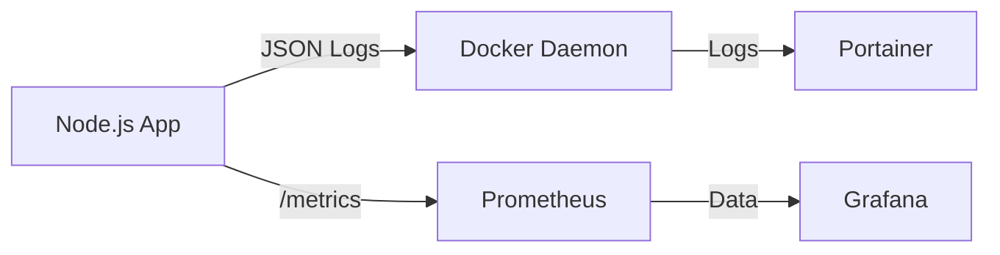

# Observability Design (可观测性设计)

> **Status**: Active
> **Version**: 1.0
> **Date**: 2026-02-25

## 1. 概述
本系统采用了基于 **Winston** (日志) 和 **Prometheus** (指标) 的可观测性方案，旨在提供实时的系统健康监控与故障排查能力。

## 2. 日志系统 (Logging)
*   **库**: `winston`
*   **格式**: JSON (结构化日志)
*   **输出**: Stdout (由 Docker/Portainer 收集)
*   **关键字段**:
    *   `level`: 日志级别 (info, error, warn, debug)
    *   `event`: 事件类型 (如 `api_request_start`, `api_request_end`, `admin_login_audit`)
    *   `requestId`: 请求唯一追踪 ID (UUID)
    *   `durationMs`: 请求耗时 (毫秒)
    *   `timestamp`: ISO 8601 时间戳

### 2.1 使用示例
```javascript
import { logger } from "../utils/logger.js";

logger.info({
  event: "user_login_success",
  userId: "u-123",
  ip: "127.0.0.1"
});
```

## 3. 指标系统 (Metrics)
*   **库**: `prom-client`
*   **端点**: `/metrics`
*   **采集方式**: Pull (Prometheus Server 主动拉取)

### 3.1 核心指标
*   `http_request_duration_seconds` (Histogram): HTTP 请求耗时分布。
    *   标签: `method` (GET/POST), `route` (/api/auth/login), `code` (200/500)
    *   桶 (Buckets): 0.1s, 0.3s, ..., 10s

### 3.2 默认指标
包含 Node.js 运行时的 CPU、内存、GC、Event Loop 延迟等标准指标。

## 4. 集成架构


## 5. 安全说明
*   `/metrics` 端点目前公开暴露，建议在 Nginx 层或防火墙层限制仅允许监控服务器 IP 访问。
